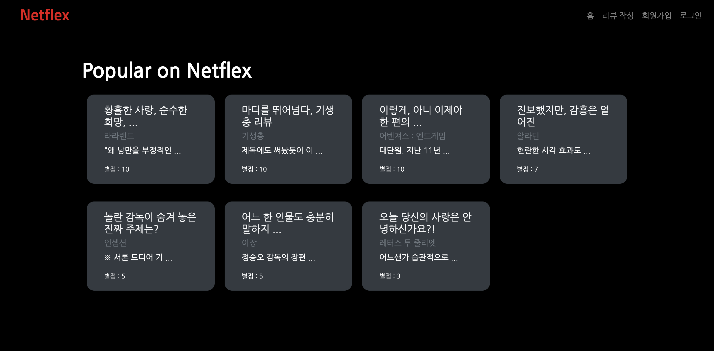
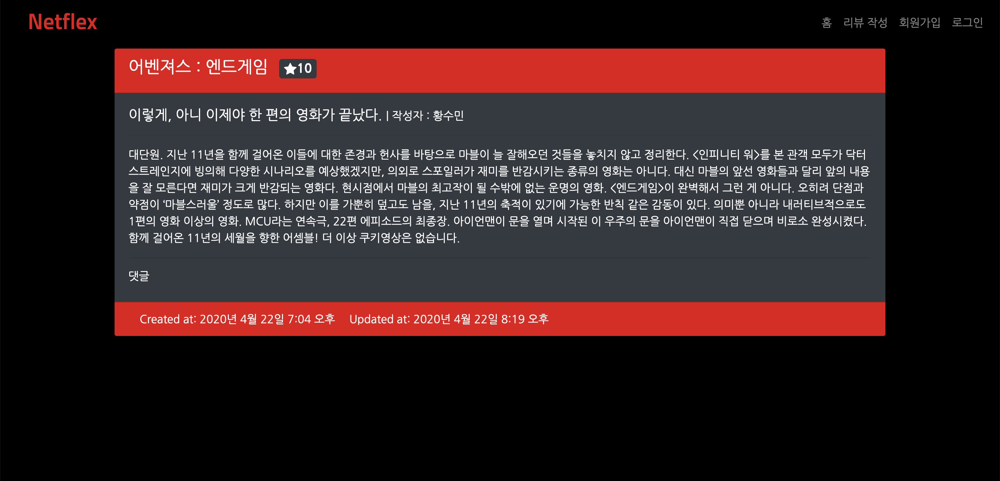
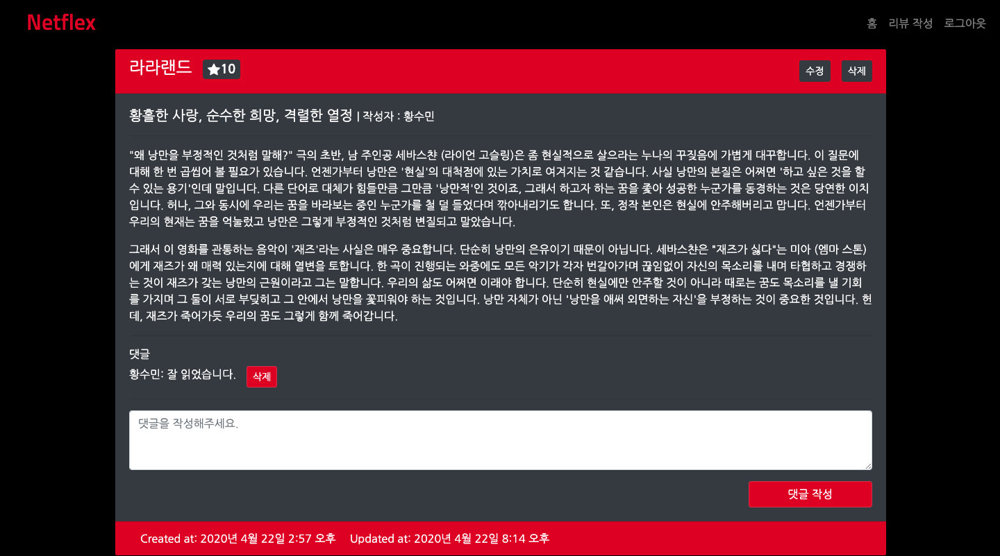
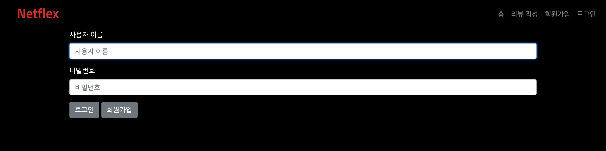
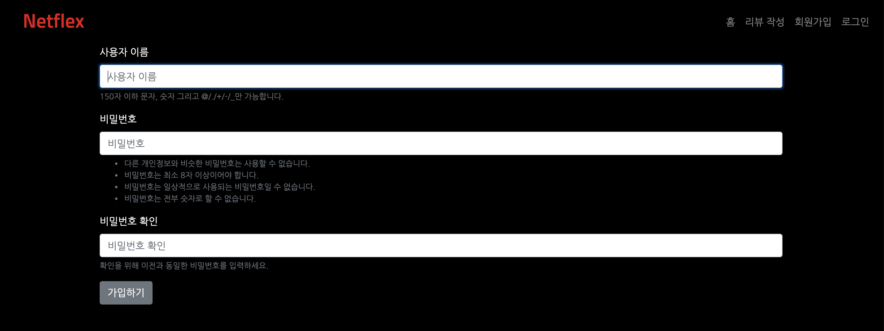
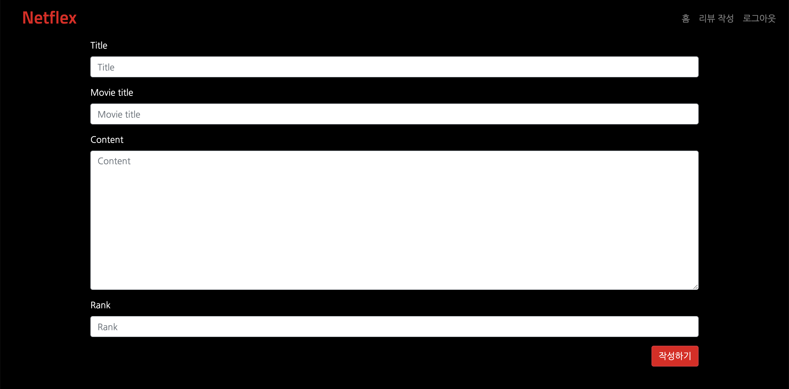

# Project 3

## 프로젝트 일시

2020년 4월 22일 오후 1시 30분~ 오후 10시 00분


## 팀원 및 역할분배

- 신채린 - 모델폼 구현, Review CR구현, 단일 리뷰 상세 조회 페이지 Frontend 담당, README 병합 및 정리
- 신영찬 - base.html, bootstrap4 연결, 회원가입 기능 구현, Review UD 구현, 전체 리뷰 목록 조회 페이지 Frontend 담당
- 황수민 - 로그인 및 로그아웃 구현, navbar 구현, Comment CRD 구현, 전체 리뷰 목록 조회 페이지 Frontend 담당, 로그인/회원가입 Frontend 담당


## 구현항목

- django framework에서 제공하는 회원 관리 기능을 이용해 회원가입 로그인 기능
- ORM을 이용해 영화 리뷰를 작성, 조회, 수정, 삭제기능
- ORM을 이용한 댓글 작성, 조회, 삭제기능
- django framework에서 제공하는 modelForm을 이용한 입력폼 구현 기능
- 외래키를 이용한 데이터베이스 `1:N`관계 구현


## 구현과정

### 영찬

---

### base.html 작성

#### base.html

- ```html
  <!DOCTYPE html>
  
  <html lang="en">
  <head>
      <meta charset="UTF-8">
      <meta name="viewport" content="width=device-width, initial-scale=1.0">
      <meta http-equiv="X-UA-Compatible" content="ie=edge">
      <title>Document</title>
      
  </head>
  <body>
      
      
      
  </body>
  </html>
  ```

  - base.html을 꾸미기 위해 `bootstrap4`를 load시켰습니다.


#### bootstrap 등록

> settings.py

- ```python
  INSTALLED_APPS=['bootstrap4']
  ```

- `base.html`에서  bootstrap4를 사용하기 위해  settings.py에 위와 같이 추가하였습니다.


### 회원가입

#### accounts/urls.py

- ```python
  from django.urls import path
  from . import views
  app_name = 'accounts'

  urlpatterns = [
      path('signup/', views.signup, name='signup'),
      path('login/', views.login, name='login'),
      path('logout/', views.logout, name='logout'),
  ]
  ```

  - 회원가입 url을 만들어줬습니다.
  - login과 logout url도 미리 작성해뒀습니다.


#### accounts/views.py

- ```python
  from django.shortcuts import render, redirect
  from django.contrib.auth.forms import UserCreationForm

  # Create your views here.
  def signup(request):
      if request.method == 'POST':
          form = UserCreationForm(request.POST)
          if form.is_valid():
              form.save()
              return redirect('accounts:login')
      else:
          form = UserCreationForm()
      context = {
          'form':form,
      }
      return render(request, 'accounts/signup.html', context)
  ```

  - views.py에서 signup 함수를 만들었습니다.

  - `if request.method==POST`으로 요청이 POST로 들어오면,

    - UserCreationForm에 POST로 들어온 값과 함께 form 변수에 넣습니다.
    - `form.is_valid()`: 검증에 성공하면 `form.save()`를 하고, 그렇지 않으면 다시 form을 던져줍니다.

  - `if request.method==POST`으로 요청이 GET로 들어오면,
  - 이미 Django에 만들어져 있는 UserCreationForm을 사용자에게 던져줘 회원가입 form을 작성할 수 있도록 합니다.


#### signup.html

- ```html
  

  

  
  <form action="" method="POST">
      
      
      <button class="btn btn-secondary">가입하기</button>
  </form>

  
  ```

  - `base.html`을 상속하기 위해 ``을 작성합니다.
  - bootstrap form을 활용하기 위해 ``가 필요합니다.


##### ⚠️ 어려운 부분

- 아직 bootstrap form을 가져오는 부분이 익숙하지 않습니다.
  - bootstrap form을 활용한다면 `{% bootstrap_form {form 이름}}` 을 사용합니다


### 수민

---

### 로그인

#### views.py

- ```python
  from django.contrib.auth.forms import UserCreationForm, AuthenticationForm
  from django.contrib.auth import login as auth_login
  from django.contrib.auth import logout as auth_logout

  def login(request):
      if request.method == 'POST':
          form = AuthenticationForm(request, request.POST)
          if form.is_valid():
              auth_login(request, form.get_user())
              return redirect(request.GET.get('next') or 'community:index')
      else:
          form = AuthenticationForm()
      context = {
          'form':form,
      }
      return render(request, 'accounts/login.html', context)
  ```


#### login.html

- ```html
  

  

  
  <form action="" method="POST">
      
      
      <button class="btn btn-secondary">로그인</button>
  </form>
  <a href="">회원가입</a>

  
  ```


### 로그아웃

- ```python
  def logout(request):
      auth_logout(request)
      return redirect('community:index')
  ```


### 로그인/로그아웃 시

- 로그인되어있을 때 로그아웃화면 노출

- 로그인 되지 않았을 때, 회원가입 및 로그인 노출

- ```python
  

  
  <h1>index입니다!</h1>
  
  <a href="">로그아웃</a>
  
  <a href="">회원가입</a>
  <a href="">로그인</a>
  
  
  ```


#### views.py

- `login_required` 추가

- `request.user_is.authenticated` 추가

- ```python
  from django.shortcuts import render, redirect
  from django.contrib.auth.forms import UserCreationForm, AuthenticationForm
  from django.contrib.auth import login as auth_login
  from django.contrib.auth import logout as auth_logout
  from django.contrib.auth.decorators import login_required

  # Create your views here.
  def signup(request):
      if request.user.is_autheticated:
          return redirect('community:index')
      if request.method == 'POST':
          form = UserCreationForm(request.POST)
          if form.is_valid():
              form.save()
              return redirect('community:index')
      else:
          form = UserCreationForm()
      context = {
          'form':form,
      }
      return render(request, 'accounts/signup.html', context)


  def login(request):
      if request.user.is_autheticated:
          return redirect('community:index')
      if request.method == 'POST':
          form = AuthenticationForm(request, request.POST)
          if form.is_valid():
              auth_login(request, form.get_user())
              return redirect(request.GET.get('next') or 'community:index')
      else:
          form = AuthenticationForm()
      context = {
          'form':form,
      }
      return render(request, 'accounts/login.html', context)

  @login_required
  def logout(request):
      auth_logout(request)
      return redirect('community:index')
  ```


#### 모델 생성

- Review 및 Comment 모델을 생성했습니다.

- ```python
  from django.db import models
  from django.conf import settings

  # Create your models here.
  class Review(models.Model):
      user = models.ForeignKey(settings.AUTH_USER_MODEL, on_delete=models.CASCADE)
      title = models.CharField(max_length=100)
      movie_title = models.CharField(max_length=30)
      rank = models.IntegerField()
      content = models.TextField()
      created_at = models.DateTimeField(auto_now_add=True)
      updated_at = models.DateTimeField(auto_now=True)

  class Comment(models.Model):
      user = models.ForeignKey(settings.AUTH_USER_MODEL, on_delete=models.CASCADE)
      review = models.ForeignKey(Review, on_delete=models.CASCADE)
      content = models.CharField(max_length=200)
      created_at = models.DateTimeField(auto_now_add=True)
      updated_at = models.DateTimeField(auto_now=True)

  ```

  - 두 모델과 유저 모델을 연결시키기 위해 ForeignKey를 사용했습니다.

- ```bash
  $ python manage.py makemigrations
  $ python manage.py migrate
  ```


#### ⚠️ 어려운 부분

- 아직 Model끼리 연결하는 부분이 익숙하지 않습니다.
- ForeignKey로 연결하며, user는 `settings.AUTH_USER_MODEL`에서 모델을 가져오고, Review를 Comment 모델에 ForeignKey를 연결할 때는 `Review` 모델을 명시해줍니다!


### 채린

---

### 모델폼 만들기

- `ReviewForm` 및 `CommentForm` 작성

- ```python
  from django import forms
  from .models import Review, Comment

  class ReviewForm(forms.ModelForm):
      class Meta:
          model = Review
          fields = ['title', 'movie_title', 'content', 'rank']

  class CommentForm(forms.ModelForm):
      class Meta:
          model = Comment
          fields = ['content']
  ```

  - 코드 중복을 피하기 위해 `models.py`에서 각 객체를 가져옵니다.
  - Review를 작성하는 form 형식을 만드는데 작성자(USER)는 로그인 정보에서 받아오기 때문에 model에 정의된 모든 colume정보들을 가져오는 옵션인 `__all__`를 사용하지 않습니다.
  - Comment를 작성할 때도 마찬가지로 외래키로 참조하고 있는 Review와 User를 사용자가 임의로 바꾸지 못하도록 하기 위해 content만 input으로 주어집니다.


### Review READ

#### url.py

- ```python
  from django.urls import path
  from . import views

  app_name = 'community'

  urlpatterns = [
      path('', views.index, name='index'),
      path('<int:review_pk>/', views.detail, name='detail'),
  ]
  ```

  - 각 리뷰의 primary key를 받아 단일 상세 조회 페이지로 넘어갈 수 있도록 url 패턴을 추가하였습니다.


#### views.py

- ```python
  from django.shortcuts import render, get_object_or_404
  from .models import Review, Comment

  def detail(request, review_pk):
      review = get_object_or_404(Review, pk=review_pk)
      context = {
          'review': review
      }
      return render(request, 'community/review_detail.html', context)
  ```

  - 사용자가 생성되지 않은 pk로 상세페이지를 조회할시에, 404 에러를 띄울 수 있도록 `get_object_or_404`를 사용하였습니다.


#### review_list.html

- ```html
  
  
  <h1>index입니다!</h1>
  
  <a href="">로그아웃</a>
  
  <a href="">회원가입</a>
  <a href="">로그인</a>
  

  
      <h2>{{review.title}}</h2>
      <h3>{{review.movie_title}}</h3>
      <p>{{review.content}}</p>
  
  
  ```

  - 인덱스 페이지에서 모든 리뷰를 조회할 수 있도록 for loop을 이용했습니다.


#### review_detail.html

- ```html
  
  

  
      <h1>{{review.title}}</h1>

  
  ```

  - 테스트용으로 단일상세조회페이지에 `{{review.title}}`까지만 출력해 보았습니다.


### Review CREATE

#### url.py

- ```python
  urlpatterns = [
      path('create/', views.create, name='create'),
  ]
  ```

  - 리뷰 생성을 위한 urlpattern을 추가하고, view의 create함수와 연결시켜주었습니다.


#### views.py

- ```python
  from .forms import ReviewForm

  def create(request):
      if request.method == 'POST':
          form = ReviewForm(request.POST)
          if form.is_valid():
              review = form.save(commit=False)
              review.user = request.user
              review.save()
              return redirect('community:index.html')
      else:
          form = ReviewForm()
      context = {
          'form': form
      }
      return render(request, 'community', context)

  ```


#### form.html

- ```html
  
  

  
      <form action="" method="POST">
          
          
          <button class="btn btn-secondary">작성하기</button>
      </form>

  
  ```


#### ⚠️ 어려운 부분

- `commit=False ` 옵션을 이해하기 어려웠는데 팀원과 소통이 도움이 되었습니다.


#### :star: ​배운점

- `commit=False`: 객체는 가져오되, 저장은 안한다는 뜻입니다. 이를 통해 객체를 나중에  save할 수 있도록 만들어줍니다.


### 영찬

---

### Review DELETE

#### urls.py

- ```python
  urlpatterns = [
      ...
      path('<int:review_pk>/delete/', views.delete, name='delete'),
      ...
  ]
  ```

  - 리뷰를 삭제하는 urlpattern을 만들기 위해 위와 같이 views의  delete함수와 연결시켰습니다.


#### views.py

- ```python
  def delete(request, review_pk):
      review = get_object_or_404(Review, pk=review_pk)
      if request.user == review.user:
          review.delete()
          return redirect('community:index')
      return redirect('community:detail', review.pk)
  ```


### Review Update

#### urls.py

- ```python
  urlpatterns = [
      ...
      path('<int:review_pk>/update/', views.update, name='update'),
      ...
  ]
  ```


#### views.py

- ```python
  def update(request, review_pk):
      review = get_object_or_404(Review, pk=review_pk)
      if request.user == review.user:
          if request.method == 'POST':
              review_form = ReviewForm(request.POST, instance=review)
              if review_form.is_valid():
                  review = review_form.save(commit=False)
                  review.user = request.user
                  review.save()
                  return redirect('community:detail', review.pk)
          else:
              review_form = ReviewForm(instance=review)
          context = {
              'review_form':review_form
          }
          return render(request, 'community/form.html', context)
      else:
          return redirect('community:detail', review.pk)
  ```


#### community/review_detail.html

- ```html
  
  

  
      <h1>{{review.title}}</h1>
      
      <a href=""><button class="btn btn-secondary" >수정</button></a>
        <form action="" method="POST">
            
            <button class="btn btn-secondary" >삭제</button>
        </form>
      
  
  ```


### Review Detail로 들어가도록 수정

#### community/review_list.html

- ```html
  

  
  
      <a href=""><h2>{{review.title}}</h2></a>
      <h3>{{review.movie_title}}</h3>
      <p>{{review.content}}</p>
  
  
  ```


#### ⚠️ 어려운 부분

- 수정버튼은 어차피 수정하기를 누를 때 POST로 보낸 것만 받기 때문에 GET으로 보내야 하고 삭제는 GET으로 못보내게 하기 위해 POST로 보낸 것 만 받게 해야 한다.


### 수민

---

### navbar 추가

#### base.html

- ```html
  <!DOCTYPE html>
  
  <html lang="en">
  <head>
      <meta charset="UTF-8">
      <meta name="viewport" content="width=device-width, initial-scale=1.0">
      <meta http-equiv="X-UA-Compatible" content="ie=edge">
      <title>Document</title>
      
  </head>

  <body>
      <nav class="navbar navbar-expand-lg navbar-light bg-light">
        <a class="navbar-brand" href="">Navbar</a>
        <button class="navbar-toggler" type="button" data-toggle="collapse" data-target="#navbarNav" aria-controls="navbarNav" aria-expanded="false" aria-label="Toggle navigation">
          <span class="navbar-toggler-icon"></span>
        </button>
        <div class="collapse navbar-collapse" id="navbarNav">
          <ul class="navbar-nav">
            <li class="nav-item">
              <a href="">리뷰 작성</a>
            </li>
            
            <li class="nav-item">
              <a href="">로그아웃</a>
            </li>
            
            <li class="nav-item">
              <a href="">회원가입</a>
            </li>
            <li class="nav-item">
              <a href="">로그인</a>
            </li>
            
          </ul>
        </div>
      </nav>
      <div class="container">
          
          
      </div>
      
  </body>
  </html>
  ```

  - bootstrap 으로 navigation bar를 추가하였습니다.


### review_detail 수정

#### review_detail.html

- ```html
  
  

  
      <h1>{{ review.title }}</h1>
      <h2>{{ review.movie_title }}</h2>
      <p>{{ review.content }}</p>
      
      <a href=""><button class="btn btn-secondary" >수정</button></a>
        <form action="" method="POST">
            
            <button class="btn btn-secondary" >삭제</button>
        </form>
      
  
  ```

- 상세 페이지에 title, movie_title, content가 모두 나타날 수 있도록 수정하였습니다.


#### base.html

- ```html
  <!DOCTYPE html>
  
  <html lang="en">
  <head>
      <meta charset="UTF-8">
      <meta name="viewport" content="width=device-width, initial-scale=1.0">
      <meta http-equiv="X-UA-Compatible" content="ie=edge">
      <title>Document</title>
      
  </head>

  <body>
      <nav class="navbar navbar-expand-lg navbar-light bg-light">
        <a class="navbar-brand" href="">Netflex</a>
        <button class="navbar-toggler" type="button" data-toggle="collapse" data-target="#navbarNav" aria-controls="navbarNav" aria-expanded="false" aria-label="Toggle navigation">
          <span class="navbar-toggler-icon"></span>
        </button>
        <div class="collapse navbar-collapse" id="navbarNav">
          <ul class="navbar-nav ml-auto">
            <li class="nav-item">
              <a class="nav-link" href="">리뷰 작성</a>
            </li>
            
            <li class="nav-item">
              <a class="nav-link" href="">로그아웃</a>
            </li>
            
            <li class="nav-item">
              <a class="nav-link" href="">회원가입</a>
            </li>
            <li class="nav-item">
              <a class="nav-link" href="">로그인</a>
            </li>
            
          </ul>
        </div>
      </nav>
      <div class="container">
          
          
      </div>
      
  </body>
  </html>
  ```

  - 로그인/로그아웃/회원가입은 오른쪽으로 정렬되도록 만들었습니다.


### Comments CREATE

#### urls.py

- ```python
  path('<int:review_pk>/comments/', views.comment_create, name='comment_create'),
  path('<int:review_pk>/comments/<int:comment_pk>/delete', views.comment_delete, name='comment_delete'),
  ```

  - comment create/delete url을 같이 추가하였습니다.


#### views.py

- ```python
  def comment_create(request, review_pk):
      review = get_object_or_404(Review, pk=review_pk)
      comment_form = CommentForm(request.POST)
      if comment_form.is_valid():
          comment = comment_form.save(commit=False)
          comment.user = request.user
          comment.review = review
          comment.save()
      return redirect('community:detail', review.pk)
  ```
  - comment를 생성하기 위한 함수를 작성했습니다.

- ```python
  def detail(request, review_pk):
      review = get_object_or_404(Review, pk=review_pk)
      comment_form = CommentForm()
      context = {
          'review': review,
          'comment_form': comment_form
      }
      return render(request, 'community/review_detail.html', context)
  ```
  - 댓글을 넘겨주기 위해 context에 `comment_form`을 추가하였습니다.


##### ⚠️ 어려운 부분

- 여전히 commit=False를 작성하는 부분을 헷갈려합니다.


#### review_detail.html

- ```html
  <form action="" method="POST">
    
    
    <button class="btn btn-secondary">댓글 작성</button>
  </form>
  ```


### Comments READ

#### models.py

- ```python
  review = models.ForeignKey(Review, on_delete=models.CASCADE, related_name='comments')
  ```

  - `related_name`: comments_set를 comments로 바꿀 수 있도록 `related_name`를 추가하였습니다.

#### review_detail.html

- ```html
  <h3>댓글 목록</h3>
  
      <p>{{ comment.content }}</p>
      <p>{{ comment.user.username }}</p>
  
  ```


#### views.py

- ```python
  from django.views.decorators.http import require_POST
  from django.contrib.auth.decorators import login_required

  @login_required
  def create(request):
      if request.method == 'POST':
          review_form = ReviewForm(request.POST)
          if review_form.is_valid():
              review = review_form.save(commit=False)
              review.user = request.user
              review.save()
              return redirect('community:index')
      else:
          review_form = ReviewForm()
      context = {
          'review_form': review_form
      }
      return render(request, 'community/form.html', context)

  @require_POST
  @login_required
  def delete(request, review_pk):
      review = get_object_or_404(Review, pk=review_pk)
      if request.user == review.user:
          review.delete()
          return redirect('community:index')
      return redirect('community:detail', review.pk)

  @login_required
  def update(request, review_pk):
      review = get_object_or_404(Review, pk=review_pk)
      if request.user == review.user:
          if request.method == 'POST':
              review_form = ReviewForm(request.POST, instance=review)
              if review_form.is_valid():
                  review = review_form.save(commit=False)
                  review.user = request.user
                  review.save()
                  return redirect('community:detail', review.pk)
          else:
              review_form = ReviewForm(instance=review)
          context = {
              'review_form':review_form
          }
          return render(request, 'community/form.html', context)
      else:
          return redirect('community:detail', review.pk)


  @require_POST
  @login_required
  def comment_create(request, review_pk):
      review = get_object_or_404(Review, pk=review_pk)
      comment_form = CommentForm(request.POST)
      if comment_form.is_valid():
          comment = comment_form.save(commit=False)
          comment.user = request.user
          comment.review = review
          comment.save()
      return redirect('community:detail', review.pk)

  ```

  - decorators를 추가하였습니다.


### Comments DELETE

#### views.py

- ```python
  def comment_delete(request, review_pk, comment_pk):
      comment = get_object_or_404(Comment, pk=comment_pk)
      comment.delete()
      return redirect('community:detail', review_pk)
  ```


#### review_detail.html

- ```html
  <form action="">
    
    <button class="btn btn-secondary">삭제</button>
  </form>
  ```

  - 댓글 목록 아래에, 삭제 form을 추가하였습니다.


#### views.py

- ```python
  @require_POST
  @login_required
  def comment_delete(request, review_pk, comment_pk):
      comment = get_object_or_404(Comment, pk=comment_pk)
      if request.user == comment.user:
          comment.delete()
      return redirect('community:detail', review_pk)
  ```

  - 로그인한 유저만 접근할 수 있도록 `@login_required`를 추가하고, POST로만 삭제할 수 있도록  `@required_POST`를 추가하였습니다.
  - 글을 쓴 유저만 삭제할 수 있도록 `if request.uesr == comment.user`을 추가하였습니다.


#### review_detail.html

- ```html
  
      <form action="" method="POST">
        
        <button class="btn btn-secondary">삭제</button>
      </form>
  
  ```

  - `method="POST"`를 추가하였습니다.
  - Comment를 작성한 사람에게만 삭제 버튼이 나타나도록 ``을 작성하였습니다.


#### ⚠️ 어려운 부분

- form을 넘겨줄 때 `method="POST"`를 넘겨주지 않아 에러가 났습니다.


### 채린

---

#### forms.py

- ```python
  class CommentForm(forms.ModelForm):
      content = forms.CharField(
          label='',
          widget=forms.TextInput(
              attrs={
                  'placeholder': '댓글을 작성해주세요.',
              }
              )

          )
      class Meta:
          model = Comment
          fields = ['content']
  ```

- content label을 없애주기 위해 label은 빈 칸으로 만들었습니다.


### detail 페이지 꾸미기

- 게시글을 bootstrap의 카드를 이용해 가져왔습니다.

- ```html
  
  

  
    <div class="card">
      <div class="card-header bg-dark text-white">
        <h4>{{ review.movie_title }}<span class="badge badge-warning"><svg class="bi bi-star-fill" width="1em" height="1em" viewBox="0 0 16 16" fill="currentColor" xmlns="http://www.w3.org/2000/svg">
    <path d="M3.612 15.443c-.386.198-.824-.149-.746-.592l.83-4.73L.173 6.765c-.329-.314-.158-.888.283-.95l4.898-.696L7.538.792c.197-.39.73-.39.927 0l2.184 4.327 4.898.696c.441.062.612.636.283.95l-3.523 3.356.83 4.73c.078.443-.36.79-.746.592L8 13.187l-4.389 2.256z"/>
  </svg>{{ review.rank }}</span></h4>
      </div>
      <div class="card-body">
        <h5 class="card-title">{{ review.title }}</h5>
        <p class="card-text">{{ review.content | linebreaks }}</p>
        <hr>
        <h6>댓글</h6>
        
          <p><small>{{ comment.user.username }}</small>: {{ comment.content }}</p>
          
            <form action="" method="POST">
              
              <button class="btn btn-secondary">삭제</button>
            </form>
          
        
        <hr>
        <form action="" method="POST">
          
          
          <button class="btn btn-secondary">댓글 작성</button>
        </form>
      </div>
      <div class="card-footer">
        <p class="text-muted">Created at: {{ review.created_at }}</p>
        <p class="mb-0 text-muted">Updated at: {{ review.updated_at }}</p>

      </div>
    </div>
  ```


#### ⚠️ 어려운 부분

- 댓글 삭제 버튼을 댓글 우측에 위치시키고 싶었는데 이 부분을 수정하는데 시간이 걸렸습니다.
  - `d-inline`을 form class에 넣어도 실행되지 않았습니다.
  - `form-inline`을 form class에 넣어 실행했습니다.
- 댓글 삭제의 버튼 크기를 줄이고 싶어 구글링을 했습니다!
  - `btn-sm`을 통해 버튼의 크기를 작게 만들었습니다.
- 댓글을 작성하는 란에 높이를 조정하는 방법을 찾고, 댓글 작성 버튼을 오른쪽으로 정렬하는 데 시간이 걸렸습니다.
  - `forms.py`에서 content의 attribute에 `col`값을 추가해주었습니다.
  - 버튼을 오른쪽으로 정렬하기 위해  `offset-10 col-2`값을 주었습니다.

#### :star: 배운점

- `form-inline`

  - ```html
    <form class="form-inline" action="" method="POST">
        
        
        <button type="submit" class="btn btn-danger">댓글 작성</button>
    </form>
    ```

  - 부트스트랩 documentation을 참고한 결과,  `"form-inline"`이라는 클래스를 작성하면 form을 inline으로 사용이 가능하다는 점을 배웠습니다.

- `btn-sm`

  - 부트스트랩에서는 버튼의 크기를 지정할 수 있다는 점을 배웠습니다.
  - `btn-sm`로 작은 버튼으로, `btn-lg`로 큰 버튼으로, 그리고 `btn-block`으로 블록 전체를 차지하는 버튼을 생성할 수 있습니다.

- `cols`

  - input의 높이를 조정하기 위해 attrs를 추가했습니다.

  - 또한, TextInput을 `TextField`로 변경하였습니다.

  - forms.py

    - ```python
      class CommentForm(forms.ModelForm):
          content = forms.CharField(
              label='',
              widget=forms.TextField(
                  attrs={
                      'placeholder': '댓글을 작성해주세요.',
                      'cols': '3',
                  }
              )
          )
      ```

  - detail.html

    - ```html
      <!-- 댓글 작성란 -->
      
      <form class="" action="" method="POST">
        
        
        <button type="submit" class="btn btn-danger offset-10 col-2">댓글 작성</button>
      </form>
      
      ```


### 평접 입력 제한

- 1에서 10까지만 평점을 입력할 수 있도록 제한하였습니다.

- forms.py

  - ```python
    class ReviewForm(forms.ModelForm):
        rank = forms.IntegerField(
            widget = forms.NumberInput(
                attrs={
                    'min':'1',
                    'max':'10',
                }
                )
            )
        class Meta:
            model = Review
            fields = ['title', 'movie_title', 'content', 'rank']
    ```


#### ⚠️ 어려운 부분

- `IntegerField`의 attribute을 변경하기 위해 어떤 필드를 사용해야 숫자를 제한할 수 있는지 몰랐습니다.
  - NumberInput과 min, 그리고 max를 이용해 해결했습니다.

#### :star: 배운점

- `IntegerField`를 사용할 때는, widget을 이용하기 위해  `NumberInput`을 이용해야 합니다.

<br>

### 글꼴 추가하기

- Google fonts에서 나눔고딕과 Sunflower 서체를 `<link href>`를 통해 가져왔습니다.

  - ```css
    body {
    	font-family: 'Nanum Gothic', sans-serif;
    }
    ```

  - ```css
    .logo{
    	font-family: 'Sunflower', sans-serif;
    }
    ```


### 수민

---

### admin 페이지에 추가

#### community/admin.py

- ```python
  from django.contrib import admin
  from .models import Review, Comment

  # Register your models here.
  class ReviewAdmin(admin.ModelAdmin):
      list_display = ('id', 'title', 'movie_title', 'rank', 'content', 'created_at', 'updated_at', 'user')

  class CommentAdmin(admin.ModelAdmin):
      list_display = ('id', 'review', 'content', 'created_at', 'updated_at', 'user')

  admin.site.register(Review, ReviewAdmin)
  admin.site.register(Comment, CommentAdmin)
  ```
  - admin에서 Review와 Comment model을 이용할 수 있도록 `admin.ModelAdin`을 상속받은 ReviewAdmin과 CommentAdmin을 생성해주었습니다.


### 회원가입 후 자동 로그인 & 에러 메시지 출력

> 회원가입 후에 자동으로 로그인이 되도록 만들었습니다.
>
> 또한,  message framework를 추가하였습니다.

#### accounts/views.py

- ```python
  from django.contrib import messages

  def signup(request):
      # ... 생략
          if form.is_valid():
              new_user = form.save()
              authenticated_user = authenticate(username=new_user.username,password=request.POST['password1'])
              auth_login(request, authenticated_user)
              return redirect('community:index')
          else:
              messages.warning(request, '폼을 다시 확인 후 제출해주세요.')
      # ... 생략

  def login(request):
      # ... 생략
          if form.is_valid():
              auth_login(request, form.get_user())
              return redirect(request.GET.get('next') or 'community:index')
          else:
              messages.warning(request, '이름과 비밀번호를 다시 확인 후 제출해주세요.')
      # ... 생략
  ```

  - Message Framework를 작성하기 위해 `from django.contrib import messages`를 추가해주었습니다.


#### community/views.py

- ```python
  from django.contrib import messages

  def index(request):
      reviews = Review.objects.order_by('-rank')
      # ... 생략

  @login_required
  def create(request):
      # ... 생략
          if review_form.is_valid():
              review = review_form.save(commit=False)
              review.user = request.user
              review.save()
              return redirect('community:detail', review.pk)
          else:
              messages.warning(request, '리뷰를 양식에 맞게 작성해주세요.')
      # ... 생략

  @login_required
  def update(request, review_pk):
      # ... 생략
              if review_form.is_valid():
                  review = review_form.save(commit=False)
                  review.user = request.user
                  review.save()
                  return redirect('community:detail', review.pk)
              else:
                  messages.warning(request, '리뷰를 양식에 맞게 작성해주세요.')
      # ... 생략
  ```

  - Message Framework를 작성하기 위해 `from django.contrib import messages`를 추가해주었습니다.


### css 만들기

> css 파일을 추가하기 위해 먼저 폴더 구조를 변경했습니다.
>
> - community 앱 내에 static 폴더를 생성하고, 그 안에  community 폴더를, 또 그 안에는 css 폴더를 만든 후, base.css 파일을 추가하였습니다.

#### community/static/community/css/base.css

- ```css
  body {
    background-color: black;
    color: white;
    font-family: 'Nanum Gothic', sans-serif;
  }
  .navbar {
    background-color: transparent;
  }
  .logo {
    color: #E50914;
    font-size: 2rem;
    font-family: 'Sunflower', sans-serif;
    margin: 0;
  }
  .card-header, .btn-danger, .card-footer{
    background-color: #E50914;
  }
  ```
  - body는 background-color를 검은색으로 지정하였고, 전체적인 font는 나눔고딕을 사용하였습니다.
  - navbar class에 `background-color`를 `transparent`로 지정하여 body의 `background-color`을 그대로 사용하였습니다.
  - 로고 역시 넷플릭스 빨간색인 #E05914를 `background-color`로 추가하였습니다.
    - 또한 로고를 부각시키기 위해 `font-size`를 2rem으로 조정하였습니다.
  - card-header, card-footer, 그리고 btn-danger 클래스에는 넷플릭스 빨간색인 #E05914를 `background-color`로 추가하였습니다.


#### templates/base.html

- ```html
  <!DOCTYPE html>
  
  
  <!-- ... 생략 -->
      <link rel="stylesheet" href="">
  <!-- ... 생략 -->
  ```

  - static을 html파일과 연결시켜주기 위해 위 코드를 추가하였습니다.


### 영찬

---

### 단일 상세 조회 페이지 꾸미기

#### review_list.html

- ```html
  

  
  <div class="mx-0">
  <h1 class="mt-5 font-weight-bold">Popular on Netflex</h1>

  <div class="container">
    <div class="row">
    
      <div class="card bg-dark col-3 my-2" style="width: 18rem; border: 10px black solid; border-radius: 25px;">
        <div class="card-body d-flex flex-column justify-content-between">
          <h5 class="card-title"><a href="" class="text-decoration-none text-light">{{ review.title|truncatechars:20 }}</a></h5>
          <h6 class="card-subtitle mb-2 text-muted">{{ review.movie_title|truncatechars:15 }}</h6>
          <p class="card-text">{{ review.content|truncatechars:15 }}</p>
          <small>별점 : {{ review.rank }}</small>
        </div>
      </div>
    
    </div>
  </div>
  </div>
  
  ```

  - 전체 리뷰 목록을 카드 형식으로 변환했습니다.
    - bootstrap의 카드를 사용했습니다.

  - 모든 글이 다 보이게 하기 보다는 title, movie_title, content 별로 글자수를 제한하였습니다
    - title : 20자
    - movie_title : 15자
    - content : 15자
  - 전체 리뷰 목록에서도 각 리뷰의 평점이 보이도록 추가하였습니다.


<br>

## 구현 화면

### 전체 리뷰 목록 페이지 화면




### 단일 상세 조회 페이지 화면




### 댓글 작성 후 단일 상세 조회 페이지 화면




### 로그인 화면




### 회원가입 화면




### 리뷰 작성 페이지 및 로그인 후 네비게이션 구현 화면




<br>

## 느낀점

### 채린

- 코드를 작성하는 방법이 다 다르다는 점을 느꼈습니다.
  - urlpattern을 하나를 작성하고, views에서 함수 하나를 작성하는 저와 달리, 다른 멤버들은 url들을 먼저 짜는 등 코딩 방법이 달랐습니다.
  - 또한 front-end 코드를 작성하는 방법이 다 제각각이었고, 제가 생각하지 못한 방식으로 grid를 짜는 모습에 배울점이 많았습니다.

- convention 맞추기
  - 팀 프로젝트인 만큼 서로를 위해 변수명, 클래스 명 등 convention을 맞춰야 편하다고 느꼈습니다.
  - 작성하기 전에는 어떤 convention을 쓸지 상의한 뒤 통일시켜야 서로가 서로의 코드를 읽기 편했습니다.
- 페어프로그래밍의 장단점
  - 장점
    - 혼자서 작성할 때는 사소한 오타나 서버 오류가 나면 뭐때문인지 발견하는 데 시간이 걸렸습니다.
    - 하지만 페어들의 도움으로 바로 오타나 오류를 잡아낼 수 있었고, 시간을 절약할 수 있었습니다.
  - 단점
    - 세 명이 함께 협업하면 당연히 시간을 단축시킬 수 있을 것이라 생각했지만, 한 사람 한 사람이 작성하는 코드를 navigate해주고, 또 navigtor가 시키는 대로 코드를 짜는 과정이 생각보다 오래 걸렸습니다.
- 페어들과 함께해서 더 즐거웠고, frontend 디자인을 더 생각해볼 수 있었고, 성장할 수 있었던 계기였습니다.

### 영찬

- 페어프로그래밍은 오류를 줄이는 코딩
  - 혼자 코딩할 때 생기는 사소한 오타를 발견하는데 걸리는 시간이 길다고 느꼈습니다.
  - 하지만 페어프로그래밍을 통해서 오타를 사전에 막을 수 있으며 오타가 있어도 발견하는데 걸리는 시간이 짧았습니다.
  - 백엔드와 프론트 엔드 사이에 데이터를 주고 받을 때 혼자만의 논리에 빠져서 오류를 찾기 힘들었는데 그런 오류를 고치는데 시간을 낭비하지 않았습니다.

- 페어프로그래밍은 협업을 위한 코딩
  - 세명이 함께하면 시간이 단축될 것이라고 예상했습니다.
  - 하지만 분담의 의미보다는 2중으로 코드를 체크해서 오류를 줄이는 개발 방법이라고 느꼈습니다.
  - 타인의 시선을 느꼈기 때문에 변수명을 지을 때 가독성을 고려해
    코드를 작성하게 되는 장점이 있었습니다.
- 함께 코딩하는 사람들의 스타일을 보면서 배울 점이 무척 많았습니다.

### 수민

- 페어 프로그래밍의 장단점
  - 장점
    - 코드를 작성하는 새로운 방법들을 볼 수 있었습니다. (특히, frontend part)
    - 네비게이터가 되어 지시를 하며 코드를 짜는 순서에 대해 정리하게 되었습니다.
  - 단점
    - 시간이 너무 오래 걸립니다.
- 꼼꼼한 사람과 빠르게 업무를 처리하는 사람이 함께 하니 빠르면서도 꼼꼼하게 일이 처리되어 좋았습니다.
- 생각이 잘 나지 않는 코드도 함께해서 빠르게 작성 할 수 있었습니다.


