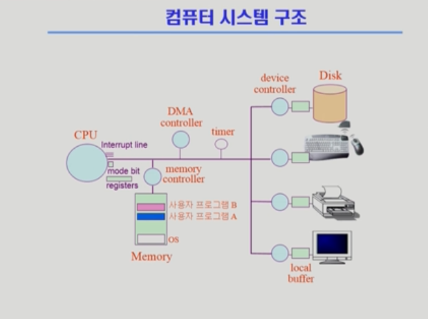
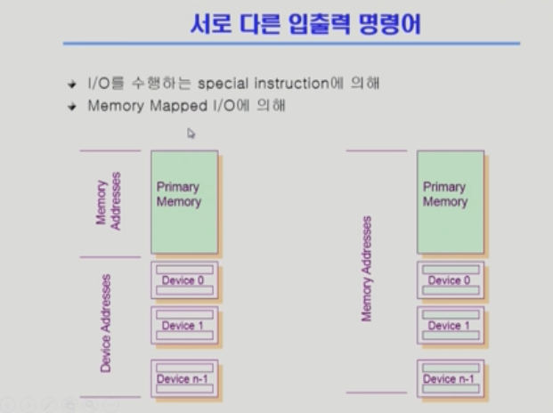
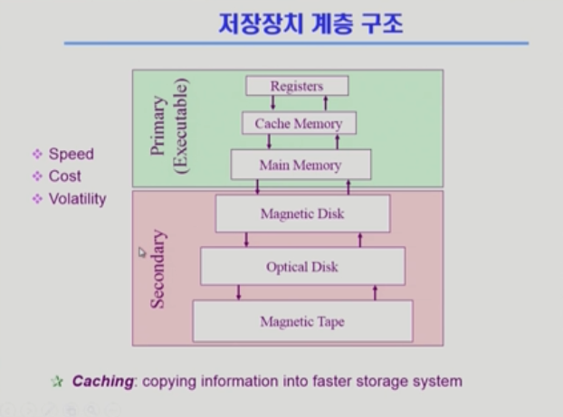
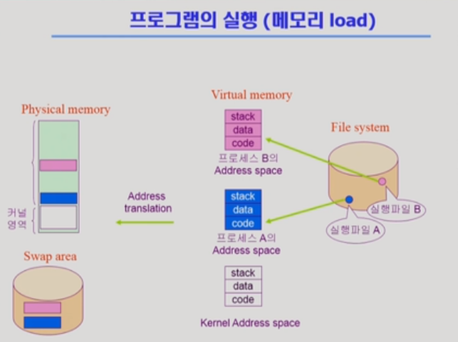
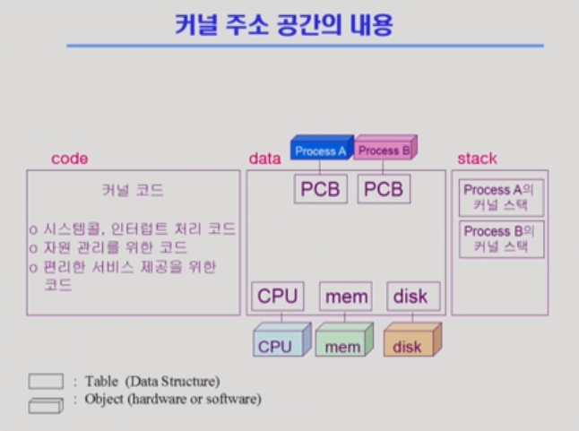
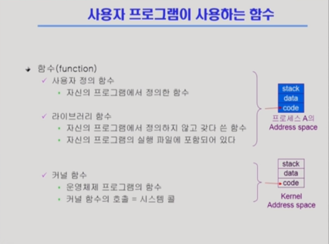

# 2차시 System Structure & Program Execution (3~4강)

http://www.kocw.or.kr/home/cview.do?mty=p&kemId=1046323

## 3강 System Structure & Program Execution 1

>  컴퓨터 시스템에서 하드웨어와 프로그램들이 어떻게 돌아가는지 설명

- CPU : 일을 처리하는 프로세서

- Memory : CPU의 작업 공간
  - CPU는 Memory에 접근해서 Instruction을 실행한다. 
- Register : Memory 보다 빠르면서 작은 공간
- Mode bit : CPU가 실행되는 곳이 운영체제인지 사용자 프로그램인지 구분
  - 0 (모니터 모드, 커널 모드): 운영체제가 CPU를 가지고 있음 (I/O 접근도 가능)
  - 1 (사용자 모드): 제한된 동작만 가능 (보안을 위해, 사용자 프로그램은 해킹의 우려가 있기 때문)
    - 시스템콜 : 사용자 프로그램이 운영체제의 서비스를 받기 위해(ex. I/O 장치에 접근) 운영체제를 호출하는 것
- Interrupt line : I/O 디바이스에서 주는 정보를 전달하기 위한 장치
  - Interrupt(넓은 의미)
    - Interrupt(하드웨어 인터럽트) : I/O 장치나 타이머 같은 하드웨어가 발생시킨 인터럽트
    - Trap(소프트웨어 인터럽트)
      - System call : 사용자 프로그램에서 운영체제의 서비스를 받기 위해(ex. I/O 장치에 접근) 인터럽트
      - Exception : 프로그램이 오류를 범한 경우
    - 인터럽트 벡터 : 해당 인터럽트가 들어오면 어디로 가야 하는지 인터럽트의 처리 루틴 주소를 가지고 있음
    - 인터럽트 처리 루틴 : 어떤 인터럽트가 들어오면 어떻게 해결해라를 운영체제에 등록해 놓은 함수
- Device controller : I/O 디바이스를 전담하는 작은 CPU 기능 (하드웨어)
  - Device driver : Device에 접근하기 위한 인터페이스에 맞게 해주는 소프트웨어 모듈 (소프트웨어)
- local buffer : Device controller의 작업 공간
- timer : 특정 프로그램(ex.무한 루프)이 CPU를 독점하는 것을 막기 위해 사용
  - Memory에 있는 프로그램을 실행할 때 timer에 시간을 걸어놓고 실행시킨다.
  - timer interrupt가 걸리면(시간이 다되면) CPU 제어권이 운영체제로 넘어간다.
  - CPU 위치 순서
    - 운영체제 -> 사용자 프로그램 -> 운영체제 -> 사용자 프로그램
- DMA(Direct Memory Access) controller : 원래 메모리 접근은 CPU만 가능하지만 DMA도 Memory에 접근 가능
  - I/O 장치가 CPU에 너무 많은 Interrupt를 하면 느려지기 때문에 DMA가 local buffer의 데이터를 Memory로 옮겨 저장하고 쌓아서 CPU에게 알려준다. 

## 4강 System Structure & Program Execution 2

>  컴퓨터 시스템에서 하드웨어와 프로그램들이 어떻게 돌아가는지 설명

- 동기식 입출력 (synchronous I/O)
  - I/O 요청 후 입출력 작업이 완료된 후에야 제어가 사용자 프로그램으로 넘어감
  - 구현 방법 1
    - I/O 가 끝날 때가지 CPU 기다림 -> 낭비
  - 구현 방법 2
    - I/O 완료될 때까지 다른 프로그램으로 넘긴다.
- 비동기식 입출력(asynchronous I/O)
  - I/O가 시작된 후 입출력 작업이 끝나기를 기다리지 않고 제어가 사용자 프로그램에 즉시 넘어감
- 둘 다 인터럽트로 I/O가 끝난 것을 알려줌

- Volatility : 휘발성
- Primary : CPU에서 직접 접근할 수 있는 메모리 스토리지 매체 (byte 단위 접근)
- Secondary : CPU가 직접 접근할 수 없는 메모리 (섹션 단위)
- Caching : 빠른 매체로 정보를 읽어들여서 쓰는 것 => 재사용 목적

### 프로그램의 실행

- Code : 기계어 코드를 담고 있는 부분
- Data : 변수(전역변수) 같은 자료구조를 담고 있는 부분
- Stack : 함수를 호출하거나 return 할 때 데이터를 쌓았다가 꺼내가는 부분

- 물리적 메모리에는 당장 필요한 부분만 올리고, 당장 안쓰는 부분은 Swap area(하드 디스크)에 위치해 있다.

- Address translation : 가상 메모리 주소에서 물리적 메모리 주소로 바뀌는 것

