# 5차시 CPU Scheduling (9~11강)

## 9강 CPU Scheduling 0

>  CPU Scheduling 개요

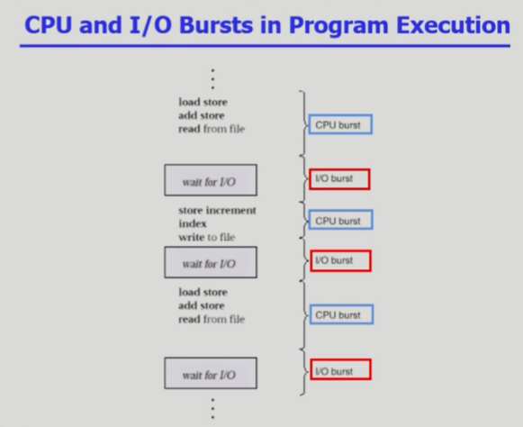

- CPU burst : CPU만 사용하는 과정
- I/O burst : I/O만 사용하는 과정

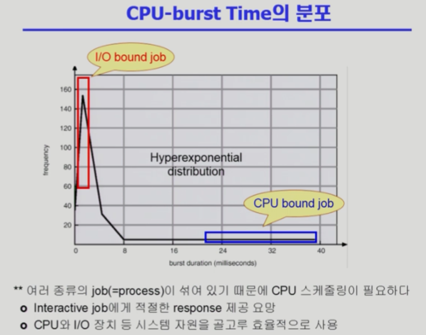

- CPU bound job : CPU를 가장 많이 쓰는 업무
- I/O bound job : I/O를 많이 쓰고 CPU를 짧게 쓰는 업무

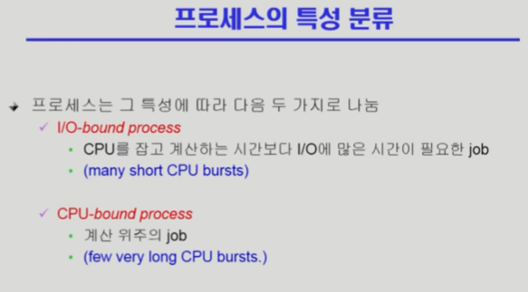

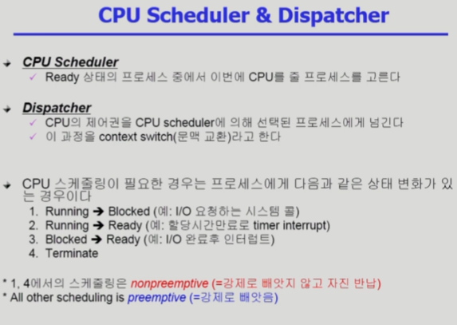

- CPU Scheduler
  - 운영체제 커널에 있는 코드
  - CPU를 누구한테 줄지 결정
- Dispatcher
  - 운영체제 커널에 있는 코드
  - CPU를 넘겨주는 과정을 담당

## 10강 CPU Scheduling 1

> CPU Scheduling 종류

### CPU Scheduling의 성능 척도

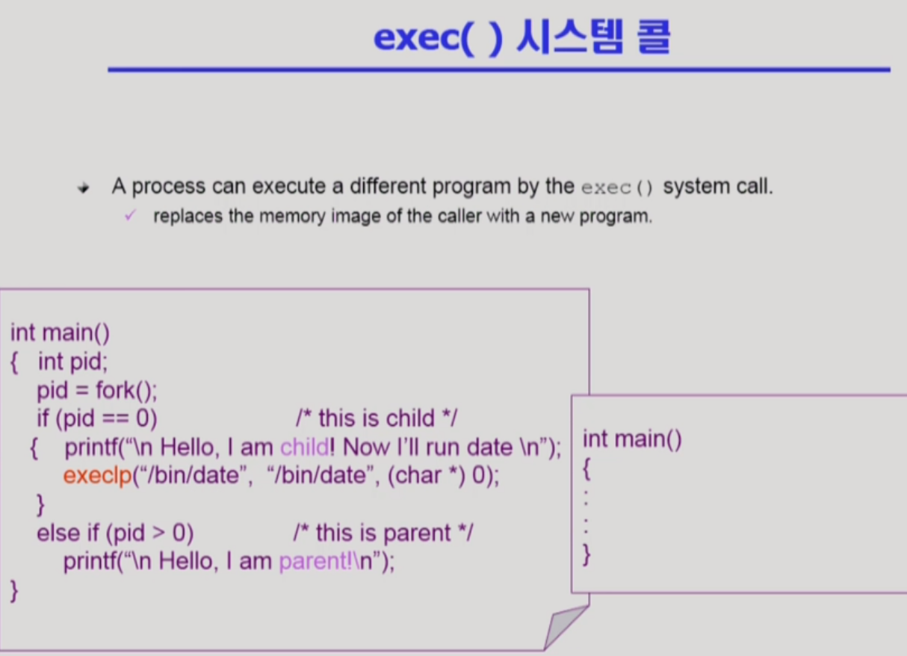

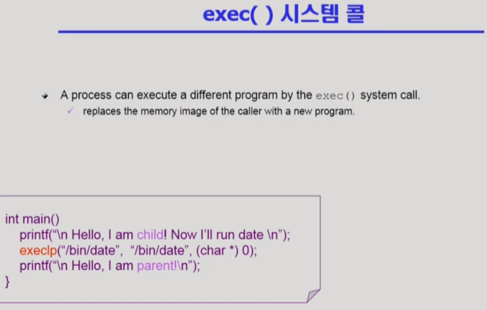

- exec은 fork 없이도 가능하다.

- main함수의 execlp 이후의 코드는 실행이 불가능하다.

#### wait()

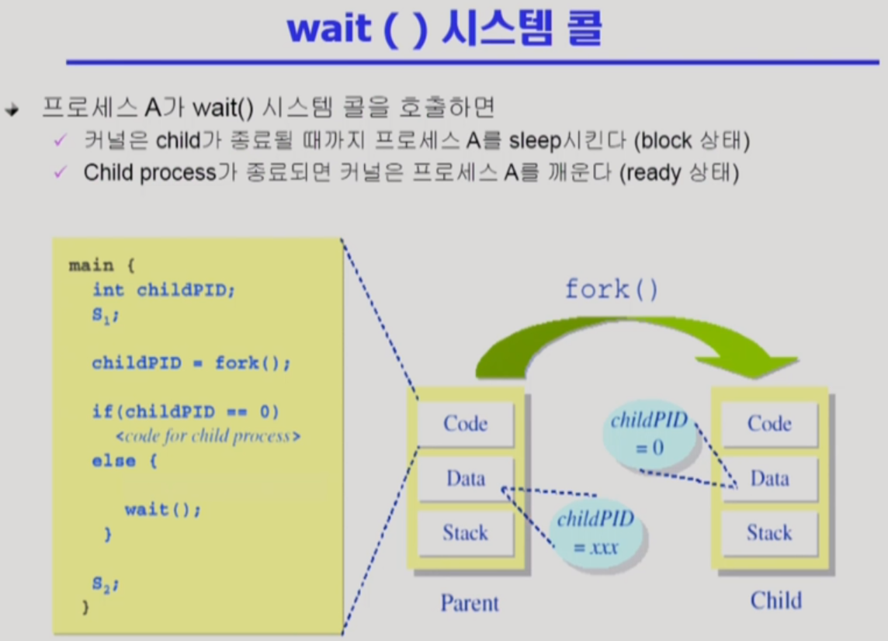

wait : 자식 프로세스가 종료될 때까지 기다리는 모델

#### exit()

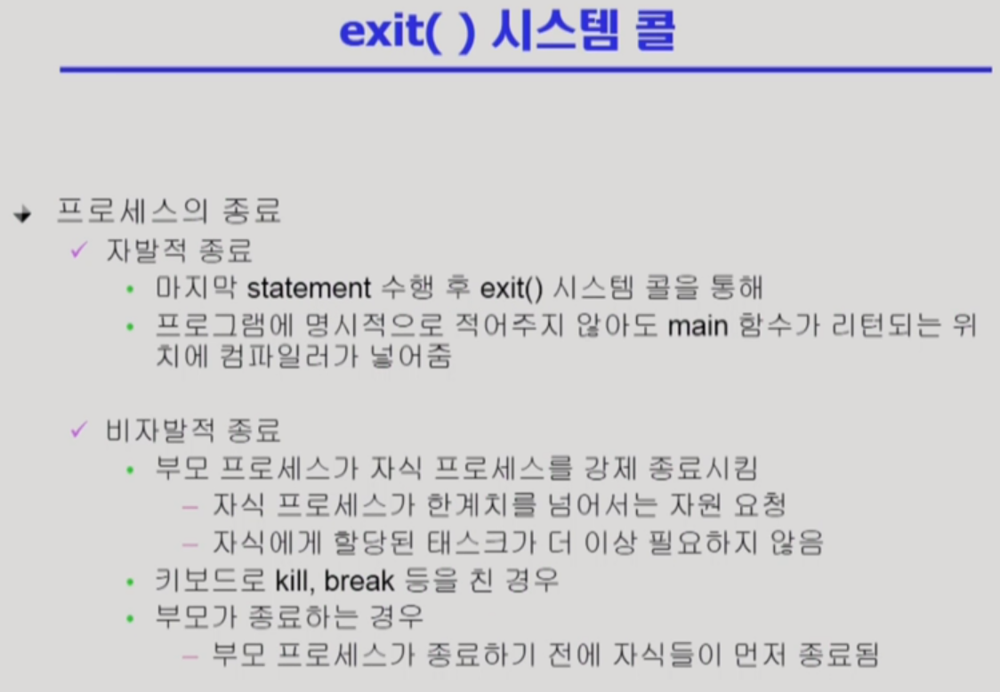

### Process 간 협력

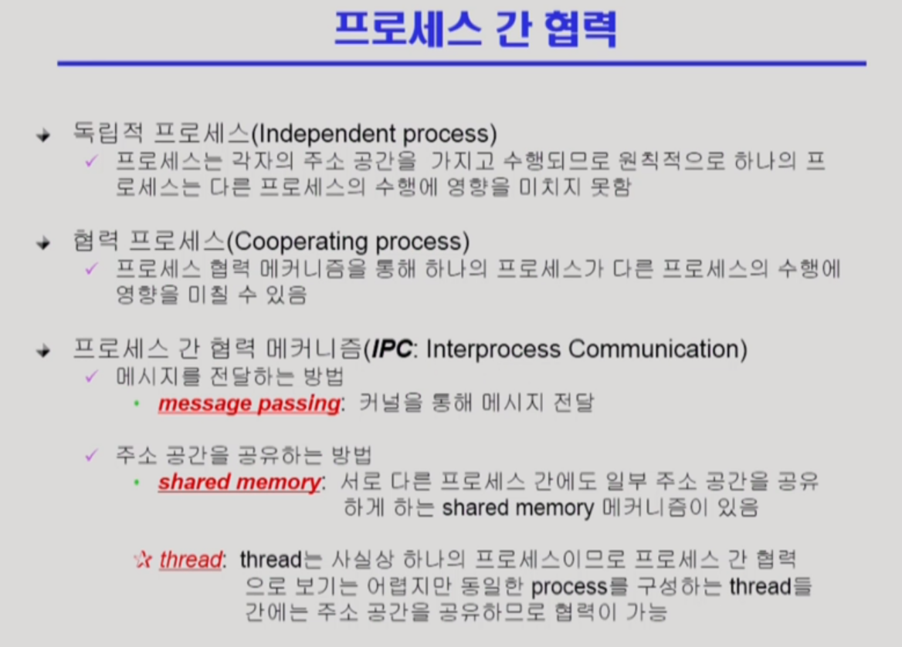

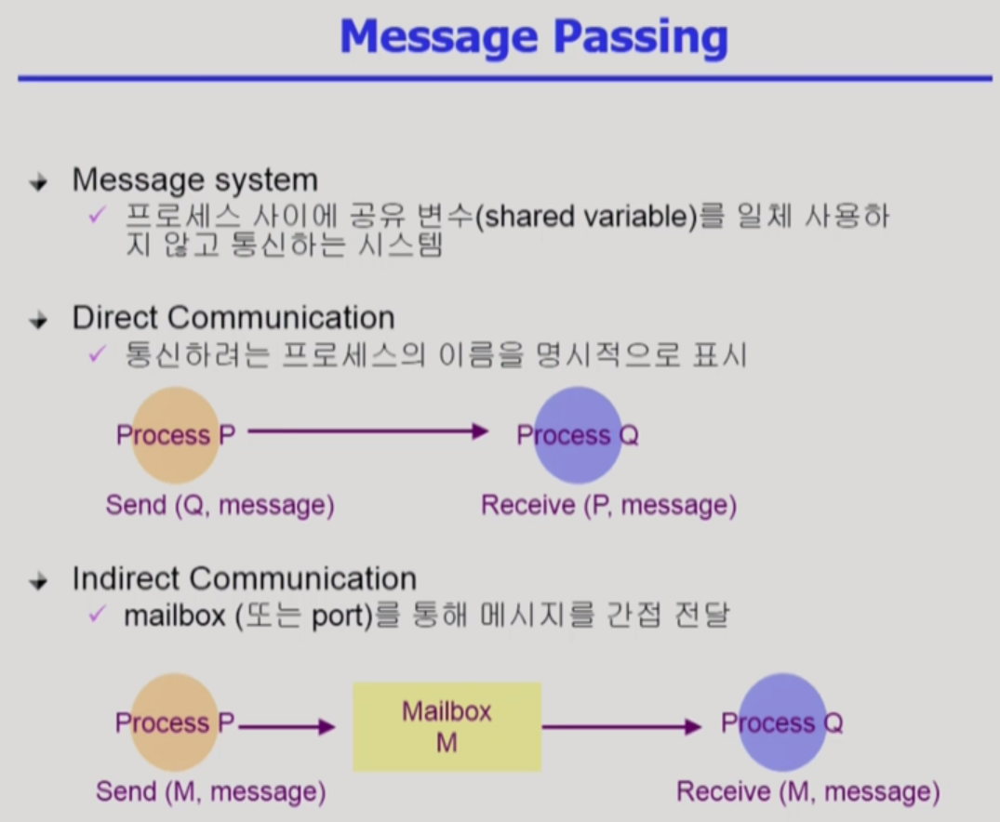

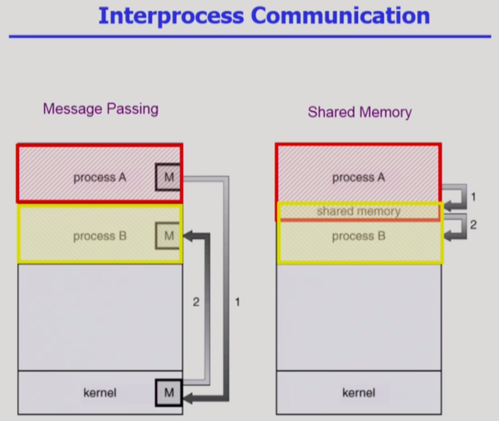

shared 메모리도 처음에는 kernel을 거쳐야 사용 가능

출처 : https://core.ewha.ac.kr/publicview/C0101020140325134428879622?vmode=f