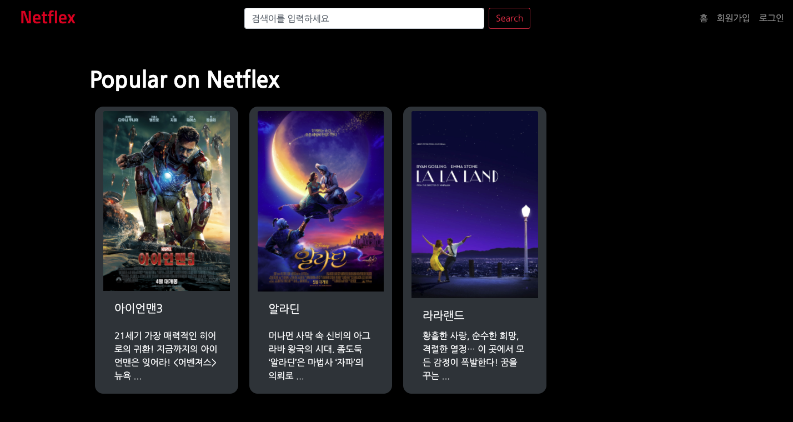
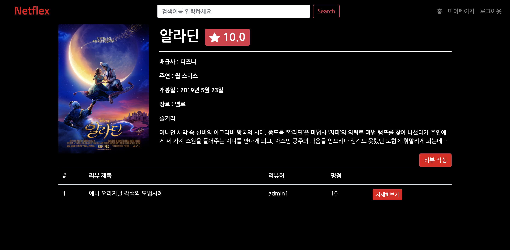
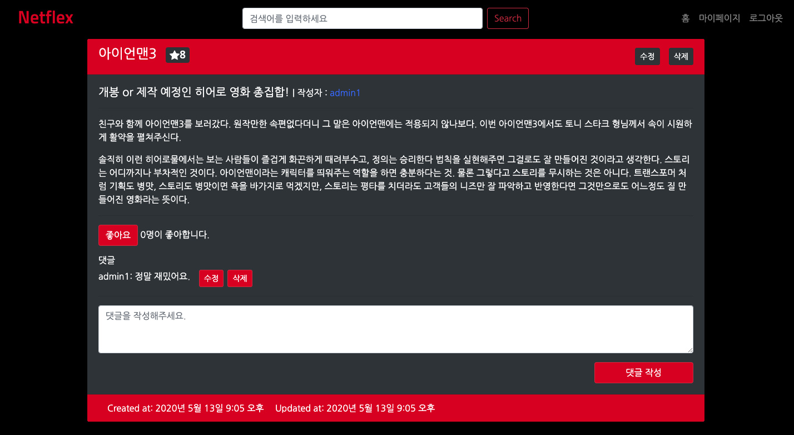
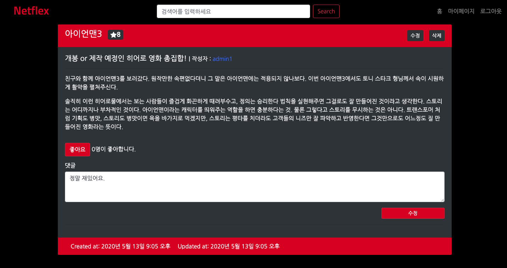
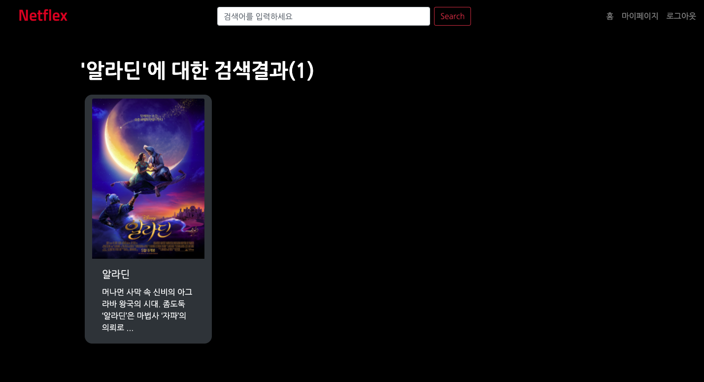
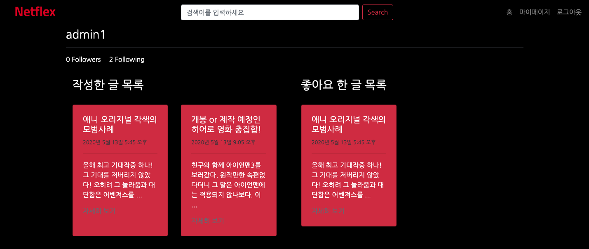
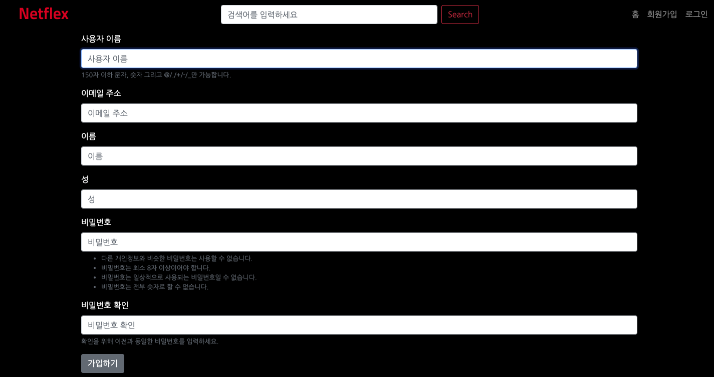
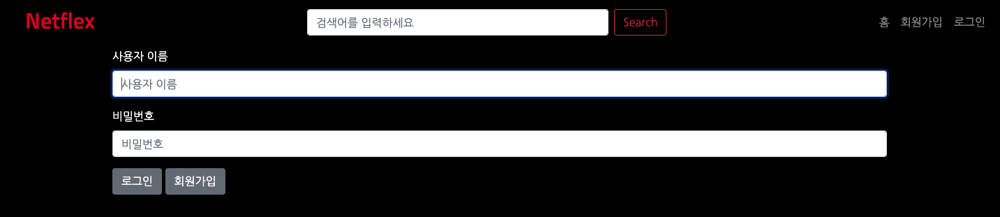

### Django-pjt4

## 구현항목

### 01. 프로젝트 구조

- 프로젝트 이름은 django_pjt4 입니다. 
- 프로젝트 안의 모든 app 및 파일은 자유롭게 설정합니다.

<br>

### 02. 필수 기능

- 모든 사용자가 영화, 리뷰, 댓글을 조회 가능합니다. 
- 인증된 사용자만 영화에 대한 리뷰를 작성합니다. 
- 작성자만 리뷰를 수정, 삭제 가능합니다. 
- 인증된 사용자만 리뷰에 대한 댓글을 작성합니다.
- 댓글 작성자만 댓글을 삭제 가능합니다. 
- 인증된 사용자만 다른 사용자를 팔로우 할 수 있습니다. 
- 본인은 팔로우 할 수 없습니다. 
- 인증된 사용자만 리뷰에 좋아요 할 수 있습니다.

<br>

### 03. 가상환경 구축

#### 1) 프로젝트 생성

```bash
$ mkdir django_pjt4
$ cd django_pjt4
```

#### 2) 가상(독립) 환경 설정

가상환경 생성 및 실행

```bash
$ python -m venv venv
$ source venv/bin/activate
```

#### 3) 패키지 설치

Django 관련 패키지 및 배포를 위한 패키지 설치

```bash
$ pip install django pillow django-extensions django-bootstrap4
```

#### 4) Django 프로젝트 생성

Django 프로젝트 생성

```bash
$ django-admin startproject django_pjt4
```

<br>

### 04. Model

> 본격적으로 프로젝트를 시작하기 전, 각 모델에 무슨 필드가 들어갈지 조원 3명이 함께 상의하였습니다.
>
> 서로 상의한 결과, 아래와 같이 구성하였습니다.

#### User

- email
- password
- first_name
- last_name
- username
- followers
- is_staff

#### Movie

- title
- poster
- distributor
- director
- leading_actor
- release_date
- genre - SF, 멜로, 액션, 코미디, 스릴러, 음악/뮤지컬, 판타지
- summary

#### Review

- movie
- user
- title
- content
- rank
- created_at
- updated_at

#### Comment

- review와 1:N

- author

- content

- created_at

- updated_at

<br>

### 05. User

#### 회원가입 구현

1. accounts/urls.py에 추가하였습니다.

   - ```python
     urlpatterns = [
     	path('signup/', views.signup, name='signup'),
     ]
     ```

2. accounts/views.py에 signup 함수를 추가하였습니다.

   - form 을 만들기 전이기에 pass라고 적어두었습니다.

3. accounts/forms.py 파일을 생성하였습니다.

   - CustomUserCreationForm 클래스를 만들었습니다.
     - 필드는 username, email, first_name, last_name을 추가하였습니다.

4. accounts/views.py에 signup 함수를 다시 작성하였습니다.

5. accounts/templates/accounts/signup.html

   - signup.html 파일을 생성하고 사용자에게 제공할 form을 작성했습니다.

     

#### 로그인 구현

1. accounts/urls.py에 추가하였습니다.

   - ```python
     urlpatterns = [
     	path('login/', views.login, name='login'),
     ]
     ```

2. accounts/forms.py 파일에 CustomUserChangeForm 클래스를 생성했습니다.

   - 필드는 username, email, first_name, last_name을 추가하였습니다.

3. accounts/views.py에 login 함수를 추가하였습니다.

4. accounts/templates/accounts/login.html

   - login.html 파일을 생성하고 사용자에게 보여줄 login form을 작성하였습니다.


#### 로그아웃 구현

1. accounts/urls.py에 추가하였습니다.

   - ```python
     urlpatterns = [
         path('logout/', views.logout, name='logout'),
     ]
     ```

2. accounts/views.py에 logout 함수를 추가하였습니다.


#### detail 페이지 구현

1. accounts/urls.py에 detail 관련 url을 추가하였습니다.

   - ```python
     urlpatterns = [
        path('<int:pk>/', views.detail, name='detail'),
     ]
     ```

2. accounts/views.py에 follow 함수를 추가하였습니다.

   - User 페이지이므로 `get_user_model()`을 통해 유저 모델을 가져오고, `get_object_or_404(User, pk=pk)` 를 통해 해당 유저를 선택해 context에 보냈습니다.

3. detail.html 파일을 생성하였습니다.

   - 우선 user 번호와 (primary key 혹은 id) username을 출력하였습니다.


#### follow 구현

1. accounts/urls.py에 follow url을 추가하였습니다.

   - ```html
     urlpatterns = [
       path('<int:pk>/follow/', views.follow, name='follow'),
     ]
     ```

2. accounts/models.py에서 유저 클래스를 별도로 만들고, followers 필드를 추가해주었습니다.
   - ManyToManyField로 followers 필드를 지정했습니다.
   - 유저 모델은 settings의 `AUTH_USER_MODEL`을 사용하였고, 
   - related_name으로 followings를 지정해주었습니다.
3. detail.html에 팔로우 기능을 추가하고, 팔로워가 몇 명인지, 팔로잉하는 사람이 몇 명인지 출력하였습니다.
   - 팔로잉: `{{user_followers|length}}`
   - 팔로워: `{{user.followings.count}}`


#### detail 페이지 꾸미기

1. admin유저 네임 하단에 위에서 작성한대로 팔로워와 팔로잉 수가 출력되도록 하였습니다.
2. col-6을 이용해 작성한 글 목록과 좋아요 한 글 목록으로 화면을 반으로 나누고, 각 목록에 한 row에 2개의 글이 출력되도록 만들었습니다.
   - 출력되는 글은 title, 작성된 시간, content를 표시합니다.
   - 또한 자세히 보기를 클릭하면 상세 리뷰를 볼 수 있습니다.

<br>

### 06. Movie

1. movies/urls.py에 추가하였습니다.

   - ```python
     urlpatterns = [
         path('', views.index, name='index'),
         path('create/', views.movie_create, name='movie_create'),
         path('<int:movie_pk>/', views.movie_detail, name='movie_detail'),
         path('<int:movie_pk>/update/', views.movie_update, name='movie_update'),
         path('<int:movie_pk>/delete/', views.movie_delete, name='movie_delete'),
     
     ]
     ```

2. 생성, 수정, 삭제 시 `request.user.is_staff` 정보를 이용해 권한을 체크해 줍니다.

3. movies/views.py에서 생성, 수정 시 사진을 첨부할 수 있도록 MovieForm에 두번째 인자로 `request.FILES`를 넘겨줍니다.

   - ```python
     form = MovieForm(request.POST, request.FILES, instance=movie)
     ```

4. `nav` 에 영화 검색창(서치 기능)을 추가하였습니다.

   - `movies/urls.py`에서  `path('search/', views.search, name='search')` 경로를 통해 영화 검색을 지원합니다.
   - 영화 제목, 줄거리, 감독, 주연배우 등의 데이터로 검색이 가능합니다.

5. 평균 별점 기능을 추가하였습니다.

   - Aggregate을 사용하기 위해 다음과 같이 import 하였습니다.

     - ```python
       from django.db.models import Avg
       ```

   - movies/views.py의 movie_detail 함수에 다음과 같이 추가하였습니다.

     - ```python
        reviews_aggregate = Review.objects.filter(movie=movie).aggregate(Avg('rank'))
       ```

   - movies/movie_detail.html에 평균 별점 기능을 별 icon과 함께 badge로 만들었습니다.

     - ```python
       <p class="h1"><strong>{{ movie.title }}</strong><span class="badge badge-danger mx-3"><svg class="bi bi-star-fill" width="1em" height="1em" viewBox="0 0 16 16" fill="currentColor" xmlns="http://www.w3.org/2000/svg">
         <path d="M3.612 15.443c-.386.198-.824-.149-.746-.592l.83-4.73L.173 6.765c-.329-.314-.158-.888.283-.95l4.898-.696L7.538.792c.197-.39.73-.39.927 0l2.184 4.327 4.898.696c.441.062.612.636.283.95l-3.523 3.356.83 4.73c.078.443-.36.79-.746.592L8 13.187l-4.389 2.256z"/>
       </svg> {{ review_rank }}</span></p>
       ```

<br>

### 07. Review

1. movies/urls.py에 추가하였습니다.

   - ```python
     urlpatterns = [
     	path('<int:movie_pk>/reviews/create/', views.review_create, name='review_create'),
         path('<int:movie_pk>/reviews/<int:review_pk>/', views.review_detail, name='review_detail'),
         path('<int:movie_pk>/reviews/<int:review_pk>/update/', views.review_update, name='review_update'),
         path('<int:movie_pk>/reviews/<int:review_pk>/delete/', views.review_delete, name='review_delete'),
         path('<int:movie_pk>/reviews/<int:review_pk>/like/', views.review_like, name='review_like'),
     ]
     ```

2. movies/forms.py 파일에서 평점을 평가할 때 1-10사이의 정수만 입력 받을 수 있도록 했습니다.

   - ```python
     rank = forms.IntegerField(
         widget = forms.NumberInput(
             attrs={
                 'min':'1',
                 'max':'10',
             }
         )
     )
     ```

3. movies/views.py 파일

   - 리뷰 작성시 로그인 된 사용자만 리뷰를 작성할 수 있도록 했습니다.
   - 리뷰 작성한 사용자만 리뷰를 수정/삭제할 수 있도록 했습니다.

4. 좋아요 기능

   - `django ORM` 에서 `filter()`를 이용해 로그인한 사용자가 이미 좋아요 표시를 했는지 확인
   - 좋아요와 좋아요 취소 기능을 같은 함수에 구현했습니다. 

<br>

### 08. Comment

1. movies/urls.py에 추가하였습니다.

   - ```python
     urlpatterns = [
     	path('<int:movie_pk>/reviews/<int:review_pk>/comments/create/', views.comment_create, name='comment_create'),
         path('<int:movie_pk>/reviews/<int:review_pk>/comments/<int:comment_pk>/update', views.comment_update, name='comment_update'),
         path('<int:movie_pk>/reviews/<int:review_pk>/comments/<int:comment_pk>/delete', views.comment_delete, name='comment_delete'),
     ]
     ```

2. movies/views에서 댓글의 작성과 수정, 삭제를 구현했습니다. 읽기 기능의 경우 review의 상세 페이지에서 자동으로 보여주고 있습니다.

   - 댓글의 작성은 로그인한 사용자에게 권한이 있으며 수정과 삭제 권한은 해당 댓글을 작성한 사용자만 부여 받도록 구현했습니다. 작업이 끝나고 나면 review의 상세페이지로 `redirect`되도록 구현했습니다.
   
3. ⚠️ 어려웠던 점:

   - 댓글 수정 버튼을 눌렀을 때, 삭제 버튼을 사라지게 하는 점과, 댓글 작성란이 전체 화면의 길이만큼 늘어나게 하고, 버튼이 아래로 내려갈 수 있도록 하는 점이 어려웠습니다.
   - 댓글 수정 버튼을 눌렀을 때 movie review 페이지 자체에서 수정하게 하는 방법을 몰라서 어려웠습니다.

   :star: 해결

   - 댓글 작성란/수정란을 `<div class="input-group">`으로 변경하여 해결하였습니다.

   - movies/review_detail.html에 `resolver_match.url_name='review_detail'`을 사용하여 댓글을 해당 화면에서 수정할 수 있도록 하였습니다.

     - `resolver_match.url_name='review_detail'`을 해주기 위해 아래와 같이 views.py를 수정하였습니다.

   - movies/views.py에서 comment_update 함수에 기존의 POST 상황과, GET의 상황을 분기하여 GET일 상황일 때도 추가하였습니다. GET의 상황일 때 기존의 comment를 가져올 수 있도록 하였습니다.

     - ```python
       def comment_update(request, movie_pk, review_pk, comment_pk):
           review = get_object_or_404(Review, pk=review_pk)
           comment = get_object_or_404(Comment, pk=comment_pk)
           if request.method == 'POST':
               if request.user == comment.author:
                   comment_form = CommentForm(request.POST, instance=comment)
                   if comment_form.is_valid():
                       comment = comment_form.save(commit=False)
                       comment.author = request.user
                       comment.review = review
                       comment.save()
               return redirect('movies:review_detail', movie_pk, review.pk)
           else:
               comment_form = CommentForm(instance=comment)
           context = {
               'review': review,
               'comment_form': comment_form
           }
           return render(request, 'movies/review_detail.html', context)
       ```

       

<br>

## 구현 화면

### 메인 페이지




### Movie Detail 페이지




### Review Detail 페이지




### 댓글 수정 화면




### 검색 화면




### 마이페이지 화면




### 회원가입 화면




### 로그인 화면



<br>

## 느낀점

### 영찬

#### [지난 프로젝트와 달라진 점]

- 지난 프로젝트에서 발전한 점으로는 이미지 파일 추가, M:N 관계 추가, User model 커스터마이징이 있었습니다.
- M:N 관계 구현을 통해 좋아요, 팔로우, 팔로잉 기능을 손쉽게 구현할 수 있었습니다. 
- User Model은 AbstractUser모델을 상속받아 이용했습니다. Django 소스코드를 들여다 보고 필요한 속성들을 저희
  모델에 맞게 응용해보았습니다.

#### [페어프로그래밍 및 협업]

- 페어프로그래밍을 통해 오타와 같은 실수를 빨리 찾아낼 수 있었습니다. 
- 서로 코드 리뷰를 해주면서 코드의 가독성이 중요하다는 것을 깨닫고 앞으로 그것을 높이기 위한 노력의 필요성을 느꼈습니다. 
- 또한 주석을 꼼꼼히 작성해 각 코드의 역할을 알려 주면 디버깅이 쉬워진다는 것을 알게되었습니다.


### 채린

#### [지난 프로젝트와 달라진 점]

- 지난 프로젝트를 더 발전시키기 위해 기존 코드에 기능을 추가하려고 하였으나, 새로운 모델과 필드가 많이 추가되어 기존 코드는 거의 사용할 수 없었습니다.
- 이미지 파일을 추가하고, Like와 Follow 기능 추가, 그리고 User Model 추가까지 새로운 기능들을 추가하면서 그동안 익숙하지 않았던 부분 (이미지 파일 추가)도 직접 구현하면서 익힐 수 있었습니다.
- M:N 관계를 추가하고 코드를 짜면서, 아직은 related_name이 언제쓰이는지 헷갈려 한다는 점을 느꼈습니다. User의 입장에서 조회를 할 때, 혹은 영화의 입장에서 조회를 할 때 지속적으로 어려워해서 이 부분에 대한 공부의 필요성을 느꼈습니다.

#### [페어프로그래밍 및 협업]

- 위에 작성한 것처럼, M:N 관계가 헷갈려할 때 다른 프로젝트 원들의 도움을 받을 수 있어 좋았습니다.
- 또한 convention 관련해서, 같이 지정하지 않았기 때문에 서로가 헷갈려했습니다. 앞으로는 프로젝트 초반에 필드를 지정했던 것 처럼 url이름과 변수명에 대한  convention을 지정해야겠다는 것을 느꼈습니다.


### 수민

#### [지난 프로젝트와 달라진 점]

- ORM을 조금 더 능숙하게 사용하여 검색 기능이나 평점의 평균 표시 기능을 구현하기가 수월했습니다.

- `is_staff`속성을 이용하면 요구사항 중 관리자에게만 권한을 가진 사용자만 영화 데이터를 생성, 수정, 삭제할 수 있다는 기능할 편리하게 구현할 수 있었습니다. 

#### [페어프로그래밍 및 협업]

- 이번 프로젝트는 코드의 양이 많아진만큼 잦은 오타와 실수가 있었습니다. 하지만 크로스 체킹을 통해 오타를 줄일 수 있었습니다.
- 초반에 url 이름과 변수명에 대한 컨벤션을 명확히 정하고 시작하지 않아 코드가 많아진 이번 프로젝트에서는 중간에 재정립을 하였습니다.