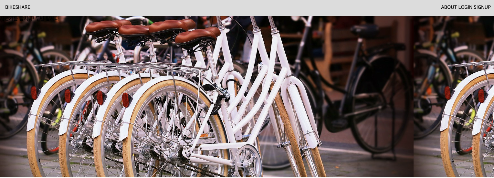
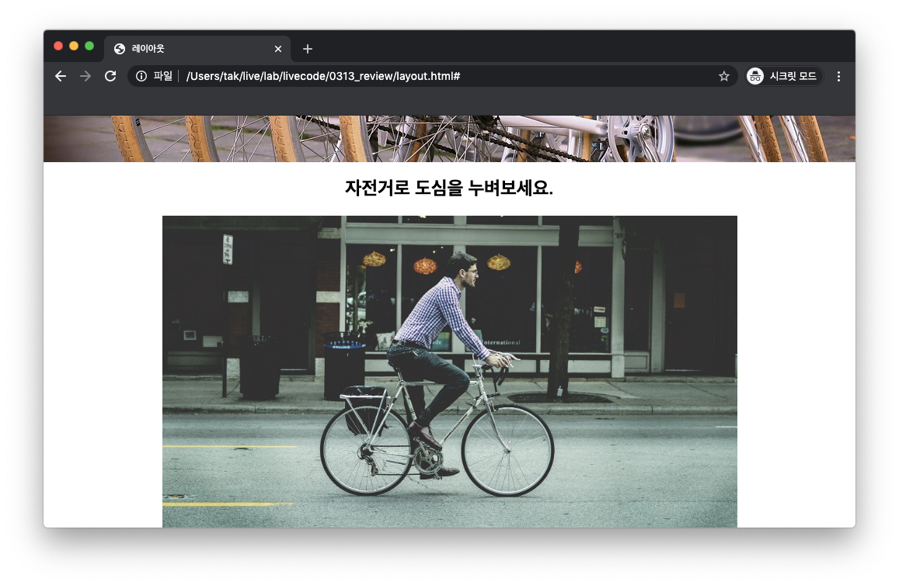

# 해설

> 라이브 강의에서 실습 시간이 부족하여 내용을 정리 해보았습니다.
>
> 영상 다시보기를 통해 확인 해보시기도 하고, 조금 더 보강한 아래의 내용을 확인하시면 도움 되실 것 같습니다.
>
> 영상에 좋아요도 눌러주세요!


## 사전 Tip

### 원칙

* HTML/CSS 기본 원칙 생각나시나요?
  * 위에서부터 차곡차곡 배치가 된다.
  * Box-model을 가지고 있다.
* 그리고 여러분의 왼손에는 `개발자도구` 오른손에도 `개발자도구` 를 통해서 반드시 디버깅을 해야합니다. 


### 생각 정리하기

* 초보자분들을 위해서는 다음과 같이 추가 정보를 드릴 수 있습니다.

  * 어떠한 영역과 겹쳐서 무엇인가가 있을 때만 => `position : absolute`

  * 우측 정렬/좌측/가운데 수평 정렬

    * inline, block 서로 다른 방식이 있었습니다. 강의 참고 해주세요. 

  * 같은 라인에 양 끝에 존재한다. (`.nav-logo`, `.nav-items`)

    ```html
    <nav>
        <a class="nav-logo" href="#">BIKESHARE</a>
        <ul class="nav-items">
          <li class="nav-item">
            <a href="#">ABOUT</a>
          </li>
          <li class="nav-item">
            <a href="#">LOGIN</a>
          </li>
          <li class="nav-item">
            <a href="#">SIGNUP</a>
          </li>
        </ul>
      </nav>
    ```

    

    1. `float`

       ```css
       nav:after {
         content: '';
         display: block;
         clear: right;
       }
       
       .nav-items {
         float: right;
       }
       ```

       

    2. `display`

       > 두 요소를 한 줄로 배치하고, 오른쪽 것을 우측 정렬으로 생각 해보실 수도 있습니다.

       ```css
       nav {
         display: table;
       }
       
       .nav-logo, .nav-items {
         display: table-cell;
       }
       ```

       * 부모요소를 table로 선언 및 자식 요소를 table-cell로 선언합니다.
       * 그리고 text-align을 통해 배치 가능합니다.
       * 아마 위처럼만 작성하면, 전체 브라우저 너비를 가지고 있지 않을텐데, nav에 `width: 100%;` 를 부여하는 형식으로 하나하나씩 작성하시면 됩니다.
       * `inline` 혹은 `inline-block` 을 활용하셔도 됩니다.
         * 이 경우 부모 요소 display 설정값은 지워야겠죠?

    3. 물론, `flex`를 쓰셔도 됩니다. (단, FAQ 참고)


## 만들어가기

### 1. nav 영역

* 마크업을 진행합니다.

  >  nav>a.nav-logo+ul.nav-items>(li.nav-item>a)*3 
  >
  > emmet으로 모든 것을 한번에 만들기보다는 HTML부터 차근차근 해보세요. 

  ```html
  <nav>
    <a class="nav-logo" href="#">BIKESHARE</a>
    <ul class="nav-items">
      <li class="nav-item">
        <a href="#">ABOUT</a>
      </li>
      <li class="nav-item">
        <a href="#">LOGIN</a>
      </li>
      <li class="nav-item">
        <a href="#">SIGNUP</a>
      </li>
    </ul>
  </nav>
  ```

* body의 margin이 불편하네요.

  ```css
  body {
    margin: 0;
  }
  ```

* .nav-item들을 한 줄로 표현하고 싶습니다..

  ```css
  .nav-item {
    display: inline;
  }
  ```

  * 여기에서, `inline`만 부여하더라도, bullet point가 사라지는 이유는 개발자도구를 통해 살펴볼 수 있습니다.
    * `<li>` 의 기본은 `display: list-item`입니다.

* .nav-logo와 .nav-items를 좌/우측으로 보낼 생각을 합니다.

  ```css
  .nav-items {
     float: right;
  }
  ```

* 개발자 도구로 탐색하고, 동일한 줄이 아닌 이유를 찾아봅니다. 

  * margin을 반드시 눈으로 확인하세요.

  ```css
  .nav-items {
    float: right;
    margin: 0;
  }
  ```

* 항상 float clear를 하는 습관을 통해 예상치 못한 결과를 방지합니다.

  ```css
  .nav::after {
    content: '';
    display: block;
    clear: right;
  }
  ```

* 마지막으로, a tag 스타일링을 모두 없애버립니다.

  * 다만, 클래스를 부여하고 직접 선택을 하는 것이 더 정확합니다. 
  * 이렇게 선택하게 된다면, 의도치 않은 변경 사항들이 발생될 수 있습니다.
  * 자손 선택자에 대해서 언급을 하고자 아래와 같이 작성하였습니다.

  ```css
  nav a {
    color: black;
    text-decoration: none;
  }
  ```

* nav 스타일링을 전체적으로 합니다.

  ```css
  nav {
    padding: 1rem;
    background-color: gainsboro;
  }
  ```

  

## 2. 사진 영역

* 마크업부터 합시다.

  * 여기 섹션은 유일하게 있는 것이니까 id를 부여 해봅니다.

  ```html
  <section id="cover">
  </section>
  ```

* 개발자 도구로 보면 영역이 없습니다.

  * 높이는 스스로 지정하지 않으면, 컨텐츠 영역에 의해 결정됩니다.

  ```css
  #cover {
    height: 500px;
    background-image: url('images/bicycles.jpg');
  }
  ```

* 너비가 길어지면 사진이 반복적으로 나오네요.

  

  ```css
  #cover {
    height: 500px;
    background-image: url('images/bicycles.jpg');
    background-repeat: no-repeat;
  }
  ```

* 이러면 아마 사진이 짤릴겁니다.

  ```css
  #cover {
    height: 500px;
    background-image: url('images/bicycles.jpg');
    background-repeat: no-repeat;
    background-size: cover;
  }
  ```

  * 참고로 배경 이미지의 영역이 가로로 매우 긴편인데, 정사각형의 사진을 쓰고 하면 위와 같은 조정들을 하더라도 만족스럽지 않게 나타납니다.
    * 이건 개발하다보면 느끼시게 될 겁니다.
    * ~~좋은 이미지.. 좋은 디자이너가 필요하다.~~

  

  
### 2.1. 추가적으로 위에 텍스트를 배치한다면,

* 배경 이미지로 했다면,
  * 마크업을 추가합니다.

  * 음 단순 문구로 하고 싶습니다. 만일,  `h1` 제목으로 쓰고 싶지 않을 수 있습니다.

      * 이건 헤딩1이다라고 생각하면, 그렇게 마크업 하셔도 됩니다.

      ```html
      <section id="cover">
        자전거를 탑시다! 두번 탑시다.
      </section>
      ```

  * 스타일링을 해야하는데 선택할 수가 없죠?

    * `#cover`의 텍스트라고 생각할 수 있겠지만 정렬 등을 위해 마크업을 하겠습니다.

    ```html
    <section id="cover">
      <span class="cover-title">자전거를 탑시다! 두번 탑시다.</span>
    </section>
    ```

  * 스타일링을 해봅시다.

      ```css
      #cover {
        ...
        text-align: center;
      }
      
      .cover-title {
        color: white;
        text-align: center;
        font-size: 2.5rem;
      }
      ```

  * 수직으로 정렬을 하고 싶습니다.

      > 수평 정렬과 다르게 수직은 HTML에서 매우매우 어렵습니다.
      >
      > 다음주 실습 중에 제가 한번 다 정리 해드릴 예정입니다.

      1. 가장 간단하고 무식한 방법은 위에 margin이나, 내부에 padding을 주는 것.

          * 이 경우 값이 변경되면 매번 바꿔줘야 하는 불편함이 있습니다.

      2. 한 줄짜리 텍스트라면, 높이와 동일한 `line-height` 값을 부여

          > 한 줄에 대한 높이를 지정하는 것입니다. 텍스트가 길어서 두 줄이 되는 경우 레이아웃이 깨집니다.

          ```css
          #cover {
            height: 500px;
            /* 여기부터 */
            line-height: 500px;
            /* 여기까지 */
            background-image: url('images/bicycles.jpg');
            background-repeat: no-repeat;
            background-size: cover;
            text-align: center;
          }
          ```

      3. 조금 더 일반적으로 배치하고 싶다면
      
          ```css
          #cover {
            /* 여기부터 */
            display: table;
            width: 100%;
            /* 여기까지 */
            height: 500px;
            background-image: url('images/bicycles.jpg');
            background-repeat: no-repeat;
            background-size: cover;
            text-align: center;
          }
          
          .cover-title {
            /* 여기부터 */
            display: table-cell;
            vertical-align: middle;
            /* 여기까지 */
            color: white;
            text-align: center;
            font-size: 2.5rem;
            }
          ```

      4. 금단의 flex를 쓴다면,
      
          ```css
          #cover {
            /* 여기부터 */
            display: flex;
            justify-content: center;
            align-items: center;
            /* 여기까지 */
            height: 500px;
            background-image: url('images/bicycles.jpg');
            background-repeat: no-repeat;
            background-size: cover;
          }
          
          .cover-title {
            color: white;
            text-align: center;
            font-size: 2.5rem;
          }
          ```
          
          
  
* 만일, img 태그를 쓰셨다면, 이미지 태그위에 해당 태그를 올리는 것이라 `absolute` 가 답입니다.


## 3. 마지막 영역

* 마크업을 합니다.

  * 이걸 우리 사이트의 큰 제목으로 두고 싶네요.

      > alt 값은 소중합니다.

      ```html
      <section id="main">
        <h1>자전거로 도심을 누벼보세요.</h1>
        
      </section>
      ```

* 가운데 정렬을 해야하군요.

  * 이미지는 text가 아닌데! 라는 생각을 하시면 안됩니다.

  ```css
  #main {
    text-align: center;
  }
  ```

  

## 4. 마지막

* 브라우저 높이를 전체 내용이 다 나오지 않게 해보시면 스크롤 내릴 때, 네비게이션바가 없습니다.

  

* 이를 브라우저의 상단에 항상 배치하려면 어떻게 하면 좋을까요.

* 지난 수업을 통해 생각 해보세요.


## FAQ

* 요소 선택자를 쓰면 안되나요?

  * 만약 네비게이션 바를 만드셨을 때, 요소 선택자(`ul`, `li` )로 했다고 가정 해보겠습니다.
  * 그 이후 계획에는 없었지만, 추후에 업데이트를 하면서 목록이 필요해졌습니다.
  * 해당하는 태그에도 적용이 되어버리겠죠.
  * 이때 다시 class를 부여하여 다시 바꾸면 번거로울 것입니다.
  * 미리 쪼개서, 설계를 한다 생각하시면 좋습니다.

  

* 클래스 이름을 짓는 방법은 따로 있을까요?

  * 정해진 것은 없지만 이러한 예시가 있습니다.

    * [BEM](http://getbem.com/)

      * CSS를 구성하는 하나의 방법론이라고 생각하시면 좋습니다.
      * 네이밍의 원칙도 나와있는데 저는 이 것을 수업을 위해 `--` 대신 `-`으로 표기하여 쓰고 있습니다.
      * 일관적인 네이밍을 시도 해보시면 좋습니다.
      * 추후에 bootstrap 등을 학습하며, hinting 을 얻을 수도 있습니다.

      

* CSS 스타일링을 선언하는 순서가 있을까요?

  * 별도로 정해진 방식은 없지만, 뒤죽박죽 작성하는 것보다는 기준이 있으면 좋습니다.

  * 예를 들면, 일반적으로 저는 아래와 같이 작성합니다. 

    > 작성하다보면, CSS는 언제 작성될지 모릅니다. 코드가 작성되어 있는 순서입니다.

    * display
      * 해당 display 관련 요소
    * 흐름을 바꾸는 요소들
      * position 및 offset
      * float, clear
    * 박스모델 밖에서 안으로
      * width, height
      * padding
      * border
      * margin
      * background
    * 스타일링
      * color, font
      * 정렬
    * 등등..


* 왜 inline, inline-block, block만 이야기 하시나요?

  * CSS를 학습하다보면, `flex` 가 거의 모든 1차원 배치를 완벽하게 지원합니다.
  * 다만, 기본로직을 반드시 익히셔야, `flex` 와의 차이점을 명확하게 익히실 수 있습니다.
  * 기존에 작성된 코드 혹은 CSS 라이브러리, 템플릿 등을 쓰게 되는 경우 여전히 `flex` 를 사용하지 않은 코드가 더 많습니다.
  * 이 모든 사항에 대처하려면 단계적으로 학습하실 필요가 있습니다.
  * 다음주 실습시간을 할애해서라도 꼭 전달드릴 예정입니다!


* 마크업할 때 `h1`, `section` 등의 기준이 있을까요?
  * 모든 것은 의미를 담고자 하는 노력입니다.
  * 내 사이트에서 제목들만 뽑았을 때 어떻게 나열되고 싶다.
  * 이 영역은 네비게이션 역할을 한다, 영역을 구분할 것이다, ... 
  * 모두 기본적으로 본인의 판단입니다. (물론, 일반적인 정의를 깨면 안되겠죠!)


### 마지막으로, 혹시 HTML tag나 css 속성을 처음 보거나 동작이 궁금하면, 교수님께 질문도 좋지만 직접 문서를 보는 습관을 하시는 것이 좋습니다.

실제로 CSS는 모두 외울 수 없기 때문에 주기적으로 확인하면서 익히셔야 합니다.

